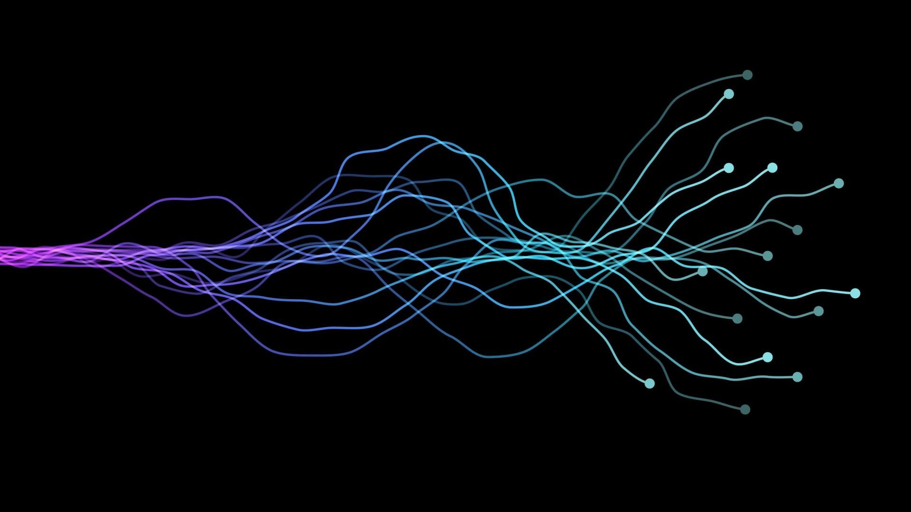

# AI/ML Projects

[![MIT License][license-shield]][license-url]
[![LinkedIn][linkedin-shield]][linkedin-url]

 

  

 

    

## Projects

* AlignTune - Config-Driven SimPO→DPO LLM Alignment + RAG
  - Engineered SFT → SimPO → hard-pair mining → short DPO polish pipeline; +9–11% ROUGE-L on long-context, parity on balanced eval, ~53.5% DPO judge win rate (from 48.5%) and safety probe 25% → 0% attack success.
  - QLoRA 4-bit + LoRA (r=8/16, α=32), 8-bit optimizer, grad checkpointing, SDPA, length-grouped left-padded batches, deterministic seeds, and autosnapshots—stable training on a single 16 GB GPU without OOM.
  - Deterministic data packs, streaming ingestion, near-dup removal, toxicity skim, per-source caps, record-level provenance; length-bucketed ROUGE-L, LLM-judge win-rate (greedy, symmetric), toxicity/1k tokens auto-rolled into RESULTS.md; FastAPI inference server + Gradio demo with versioned LoRA adapters/tokenizer snapshots for drop-in deployment.
  - RAG (FAISS-CPU; deterministic chunking; top-k + token-aware packing) adds cited, doc-grounded context at serve-time with no extra VRAM.
* Residual PatchTST - Calibrated Transformer Forecasting
  - Post-calibration WMAPE 0.276% (≈ −48% vs baseline, −53% vs uncalibrated), Central-80% = 78.85% at τ=1.282 (near target), with tight bands (~1.43% of P50) and stable rolling results (K=5, WMAPE 0.276–0.313%). 
  - Residualization on lag-52 seasonal baseline → dilated conv stem + Transformer encoder + patch tokenization → adaptive quantile head trained with weighted pinball + aux P50 MSE + monotonicity penalty → horizon-wise linear calibration + temperature scaling.
  - Deterministic seeds, mixed-precision, train-only scalers, order enforcement for P10/P50/P90, rolling backtests with RMSE/MAE/WMAPE and band diagnostics, plus exportable artifacts for BI integration and reporting. 

## License

Distributed under the MIT License. See `LICENSE` for more information.

[license-shield]: https://img.shields.io/github/license/othneildrew/Best-README-Template.svg?style=for-the-badge
[license-url]: https://github.com/xtronaltic/Personal-Data-Science-Projects/blob/main/LICENSE
[linkedin-shield]: https://img.shields.io/badge/-LinkedIn-black.svg?style=for-the-badge&logo=linkedin&colorB=555
[linkedin-url]: https://www.linkedin.com/in/gaitianpeng
